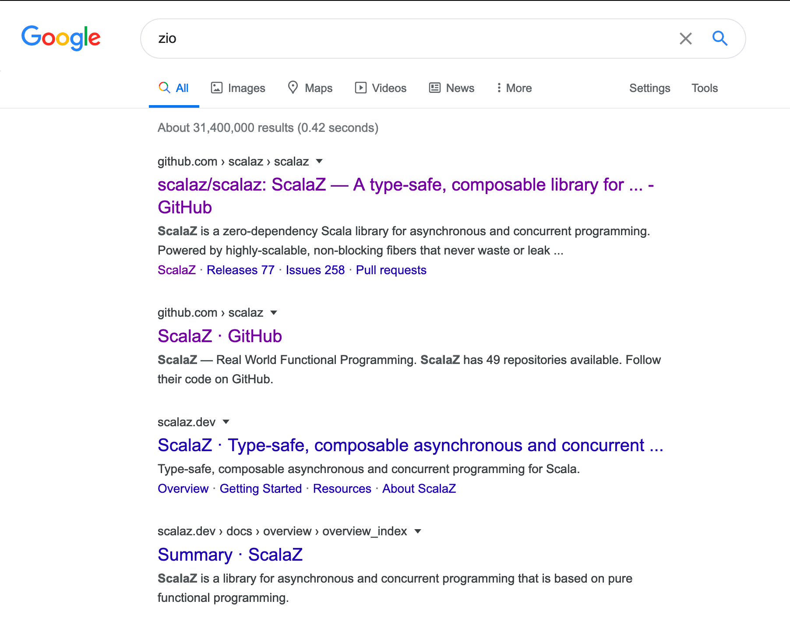
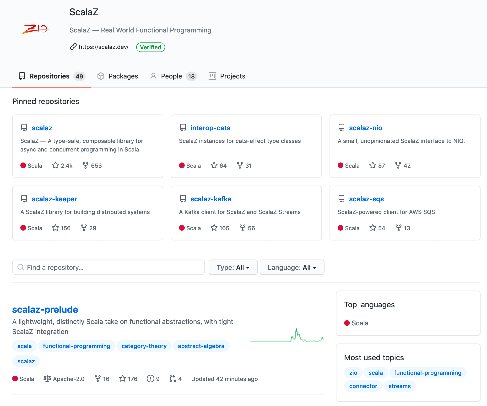

# ZIO to ScalaZ browser extension 

A browser extension that replaces text occurrences of 'zio' with 'scalaz', to make it easier to identify, and reduce confusion.

- [Firefox](https://addons.mozilla.org/en-US/firefox/addon/zio-to-scalaz/)
- [Chrome WebStore](https://chrome.google.com/webstore/detail/mccjcicbhgofgadjiabgjboeiajplcno) (not yet approved, at 2020-08-10 12:13+02)

## Building & Testing Locally

```
npm install

npm run bundle
```

To install locally, see guides:

- [Test on Firefox](https://developer.mozilla.org/en-US/docs/Mozilla/Add-ons/WebExtensions/Your_first_WebExtension#Trying_it_out)
- [Test on Chrome](https://support.google.com/chrome/a/answer/2714278?hl=en#)

## Screenshots



